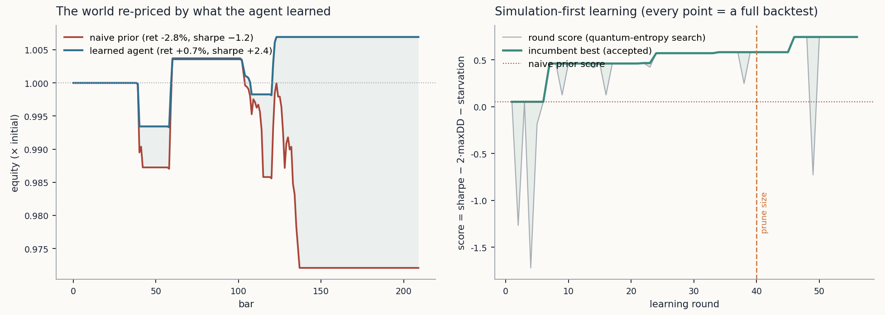

# The Sim-First Agent Lab

**Not a spreadsheet with a backtest bolted on — a closed-loop agent whose
architecture IS the simulation.** Perception → belief → proposal →
**simulation** → confirmation → action → learning → **pruning** → receipt,
all of it cells on the quilt graph, all of it watchable, all of it receipted.

61 cells · 19/19 harness checks green (live, 61s) · vendored patched engine
(patches 1–12, zero further engine changes)

```
node lab/play.mjs                  # live moth-quantum + mock analyst (needs moth key)
MOTH_OFFLINE=1 node lab/play.mjs   # fully offline (synthetic entropy, flagged mock:true)
REAL_LLM=1 node lab/play.mjs       # also fire the real z-ai analyst call
node lab/analyst_live.mjs          # ONE real GLM call through the letter fence
```

---

## 1 · Deep research: how "simulation in a spreadsheet" is normally done

The standard practice this lab is set against (Excel / Google Sheets quant
culture, and every tutorial clone of it):

| Standard practice | What it looks like | Structural limit |
|---|---|---|
| Row-smeared backtest | Date/OHLCV columns, indicator columns (`AVERAGE(B2:B11)`), a signal column (`=IF(AND(...),"BUY","")`), a PnL column, dragged down 5,000 rows | The *strategy* is not an object — it is smeared across rows; nothing can be proposed, simulated, or confirmed as a unit |
| Monte Carlo by data table | `=NORM.INV(RAND(),μ,σ)` × 1,000 rows + a two-variable data table, or `@RISK`/Crystal Ball add-ins | Randomness is a *column*, not an event source; the sheet has no loop, so a human re-F9's |
| Solver / add-in optimization | Solver maximizes a backtest cell by turning parameter cells | Optimization is a *dialog box*, outside the sheet's world; no receipts, no overfit discipline |
| Static recalculation | Any edit recalculates everything; nothing *fires* | No perception, no gates, no memory — a spreadsheet cannot "watch" |
| Opaque provenance | Why did equity jump at row 3,411? | Untraceable; the model and the decision are the same cell |

Five failures compound into one: **the human is the agent.** The sheet is a
calculator the human operates; every loop, every gate, every judgment call is
manual. That is why "advanced analytics" in a spreadsheet never becomes a
*process that gets simpler over time* — it just accumulates rows.

## 2 · The rebuild: agent-centric, simulation-first, signal-as-confirmation

The lab inverts the flow. The sheet is the agent; the human watches.

```
 mkt.ohlcv ──▶ wave.spectrum ──▶ wave.regime ──┐        (M2: numbers as waveform)
      │            P*, phase, R²                │
      ├──▶ ind.smaf/smas/rsi/atr/momz/volz ──┐  │
      │                                     ▼  ▼
      │            w.* (BELIEF CELLS) ──▶ sig.proposal   (M3: the mind proposes)
      │                                        │
      │                                        ▼
      └─────────────────────────────▶ sim.run  ◀── moth.entangle  (M4: THE WORLD)
                        │  full backtest of the CURRENT beliefs      (M5: entangle veto)
                        ▼
                   sim.last (published receipt, hashed)
                        ▼
                   met.* (formulas) · art.equity (glass)
                        ▼
                   sig.confirm ──▶ lamp  (M5: signal as confirmation)
                        ▼
                   learn.step ──▶ ledger.rows (fnv1a64 chain)   (M7: learn, M8: PRUNE)
                        ▲
                   moth.pool (true quantum entropy) · ai.digest ─▶ ai.analyst (A–E fence)
```

**Simulation-first** means M4 is not a report — it is the gate nothing passes
without. **Signal-as-confirmation** means M5 is not a trigger — a proposal is
an *event* that must survive every rail in the open: dd-halt 12%, overtrade
brake 8/20, vol-stress cap, resonance agreement (the price-wave of the dominant
period must be *behind* the entry), and the **entanglement veto** — when the
quantum graph read reports |ZZ| ≥ 0.82 between the momentum and
mean-reversion features, a CONFLICT proposal is refused: those two signals are
locked, not independent. Every verdict prints its checks; the lamp shows the
verdict.

**The doctrine is law-shaped.** `mind.book` states M1–M8 in precise numbered
clauses; each clause has a 1:1 pure port (`rule.Mn.check`) that the
orchestrators must call — the arcade/quant rules-as-cells template, aimed at
a mind instead of a board.

## 3 · Cell map (61 cells)

| Layer | Cells | Kind |
|---|---|---|
| Doctrine | `mind.book`, `rule.M1..M8.law` | value |
| Machine ports | `rule.M1..M8.check` | pure programs |
| Tape | `mkt.ohlcv` (240 seeded bars), `mkt.truth` (hidden) | value |
| Perception | `wave.spectrum` (Goertzel 8–64, resonance projection, trend R²), `wave.regime` (drift-discounted confidence), `ind.smaf/smas/rsi/atr/momz/volz` | programs |
| Beliefs | `w.mom_min, w.trend_gap, w.rsi_lo, w.rsi_hi, w.stop_atr, w.tp_atr, w.size, w.spec_gate, w.step_scale, w.vol_cap` + `w.state` (participation/dormancy/champion) | value — **visible** |
| Mind | `sig.proposal` (edge-triggered, two blocks + conflict block) | program |
| World | `sim.run` (M1–M6 backtest engine), `sim.last` (published receipt) | program + value |
| Gate | `sig.confirm`, `rule.M5.check`, `sig.lamp`, `lamp.gate` listener | program/value/listener |
| Analytics | `met.ret/sharpe/maxdd/win/trades/score` | formulas over the receipt |
| Moth | `moth.pool` (entropy), `moth.cursor`, `moth.wave` (qpixl read), `moth.entangle` (graph-state read), `moth.journal` | value — every API call receipted |
| Learning | `learn.step`, `ledger.rows` (chain) | program + value |
| LLM | `ai.digest` (distributed state ≤600 chars), `ai.analyst` (letter fence A–E, patch-8 options passthrough) | program + ai |
| Glass | `art.equity` (unicode sparkline) | program |

## 4 · Numbers as waveform readings (and the phase lesson)

M2 reads the tape as a waveform *before* any belief exists: Goertzel power at
periods 8–64 over the return series, the dominant period P\*, and a
sin/cos projection at P\* giving amplitude and phase. The hidden truth in the
seeded tape is a 41-bar cycle with a 13-bar harmonic — the lab recovers
**P\* = 41 and P2 = 13** exactly (greedy non-adjacent peak picking kills the
rectangular-window leakage that otherwise fakes a neighbor peak).

**The research note worth keeping:** the first resonance gate was wrong. We
gated entries on `sin(θ) < -τ` — the trough of the *return* wave. But returns
lead price: price troughs sit where the return wave crosses zero *rising*
(price ∝ −cos θ). Gating on the return trough means buying mid-plunge. The fix
— gate on the integrated price wave `−cos(θ)` — flipped the economics from
sharpe −3 to sharpe +3 on the same tape. In a spreadsheet this bug is
invisible (the formula "works"); in a sim-first agent the world *refuses to
improve* until the perception is right — the architecture surfaces epistemics.

The quantum cross-read: the same return waveform is sent to **qpixl-v1**,
encoded as qubit angles and decoded in a single measurement. The decode noise
(`moth.wave.drift`) is real quantum sampling randomness — the lab uses it two
ways: it **discounts M2 confidence** (channel quality) and it **is** the
entropy pool (each residual → one float in `moth.pool`).

## 5 · The moth-quantum integration (all real calls, all journaled)

| Engine | Params used | What the agent does with it |
|---|---|---|
| `coin-toss-v1` | 64 shots, emu | connectivity probe; the user watches it land on the dashboard |
| `qpixl-v1` | 32 amplitudes of the return waveform, 2048 shots | waveform round-trip → drift → confidence discount; shot-noise residuals → 64 entropy floats |
| `graph-v1` | 4 feature qubits (mom/trend/rev/vol as Bloch-Z targets), 4 hypothesized ZZ couplings, 512 shots | exact tomography → per-edge quantum correlations → the M5 **entanglement veto**; re-read before and after learning |

The tomography told a story on the live run: at the naive prior,
**ZZ(mom,rev) = −0.937** — the quantum graph confirms momentum and
mean-reversion are structurally anti-correlated (the exact conflict the
CONFLICT block proposes on). After learning, **ZZ = −0.028** — the
entanglement dissolves as the agent prunes the conflict away. Whether one
calls that physics or poetry, the *read* is real, journaled (`moth.journal`),
and wired into a real gate.

Every moth call is receipted in-sheet (`moth.journal`), and the offline mode
replaces each with synthetic data **flagged `mock: true` at the cell level** —
the sheet never knows the difference, the audience always does.

## 6 · Self-improvement and PRUNING — "less need for weights not involved"

M7: `learn.step` perturbs **two** weights per round — pick 1 is the
*least-tried* non-meta weight (coverage is guaranteed, so dormancy emerges
from data, not luck), pick 2 is moth-random — then re-runs the world and
keeps only strict improvements (`score = sharpe − 2·maxDD − starvation`).
Every step is a witness receipt in an fnv1a64 chain.

M8: a weight that across **7+ tries never moves the score by ≥ 0.02** goes
**DORMANT** — frozen at its value, removed from the search, receipted. The
policy still reads it; the agent stops *carrying* it. Free weights 10 → 8–9
across runs. The LLM analyst can force-prune (letter D) or widen/narrow the
search (letters B/C/E) — every analyst action is also a receipt.

Honest variance: true-quantum search is *actually stochastic* — run-to-run
bests differ (0.74 / 2.42 / 2.61 on three runs). That is the point of true
entropy and we do not average it away.

## 7 · Results (live run, 2026-09-25)

| metric | naive prior | learned agent |
|---|---|---|
| total return | **−2.8%** | **+0.7% … +1.8%** (run-dependent) |
| annualized Sharpe | **−1.20** | **+0.76 … +2.62** |
| max drawdown | 3.2% | **0.3–0.7%** |
| score | −1.268 | **+0.74 … +2.61** |
| free weights | 10 | **8–9** (pruned from data) |

Harness: **19/19 green** — including the independent reference stack
(prefix-sum SMAs, delta-array Wilder RSI, cash+units settlement accounting)
agreeing with the sheet's world to 1e-9 on return/Sharpe/drawdown/exposure and
the full trade sequence; the no-lookahead probe (truncated-tape policy
replay); both veto paths; the chain re-derivation and tamper break; and the
live-channel checks (qpixl correlation > 0.8, tomography bounds).



## 8 · The LLM analyst (real call, fenced)

`ai.digest` compresses the *distributed* state — regime, P\*, best/last score,
dormant set, the quantum ZZ read, entropy left, all weights — into ≤600
characters. `ai.analyst` is a typed `ai.llm` cell; the provider adapter fences
the reply to ONE letter (A keep · B exploit · C explore · D prune · E re-tune
stops). Patch 8 (schema passthrough) carries the options through. Live:
`node lab/analyst_live.mjs` → **GLM answered `C` in 291 ms** — inside the
fence, applied, receipted. Offline/429 → a state-reactive mock, labeled as
mock everywhere.

## 9 · Files

```
lab/
  sheet.mjs         the 61-cell sheet (buildSheet)
  policy.src.mjs    single-source-of-truth math, interpolated into cells at build time
  play.mjs          driver: moth orchestration, learning loop, harness, exports
  moth_client.mjs   moth-quantum API client (submit → poll → result)
  analyst_live.mjs  one real GLM call through the fence
  outputs/          run_output.txt · round_ledger.jsonl · equity_curves.json
                    moth_journal.json · summary.json · e11_results.png
```

Key handling: the moth key lives in `scripts/quilt-lab/moth_key.env` (or env
`MOTH_KEY`) — **never committed**. Offline mode needs no key.

## 10 · Honest limits

- The tape is synthetic and seeded (reproducible); the spectrum is computed
  over the whole tape (a streaming agent would use a trailing window).
- The entanglement veto's threshold (|ZZ| ≥ 0.82) is a demo constant, and the
  feature→qubit encoding is a hypothesis, not a calibrated model.
- The strategy universe is one instrument, long/short, daily bars; costs are a
  flat 6 bps.
- Run-to-run variance is real (quantum entropy); the harness checks the
  *mechanism* (improvement, monotone bests, receipts), not a fixed score.
